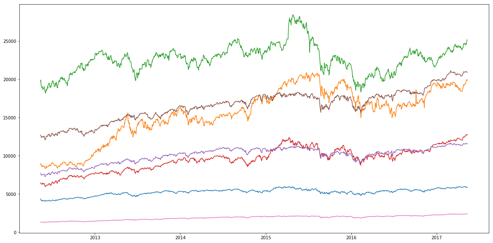
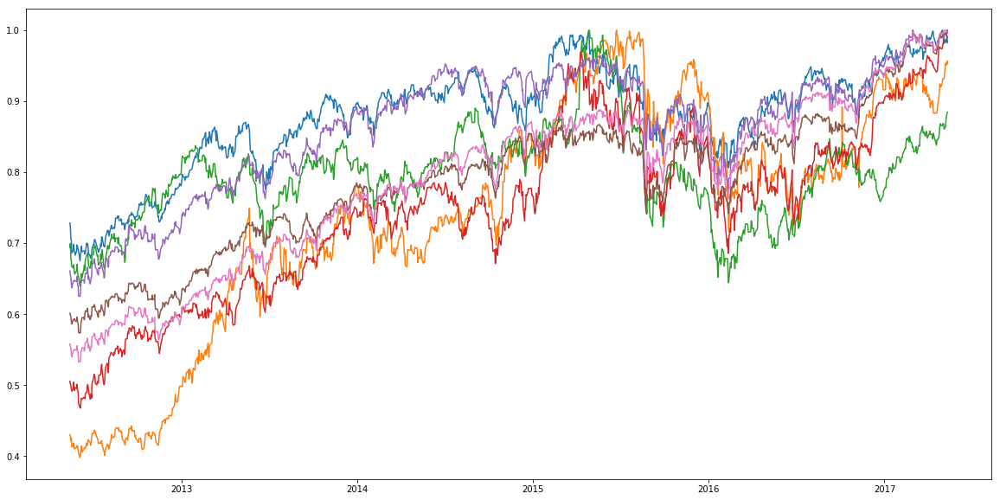
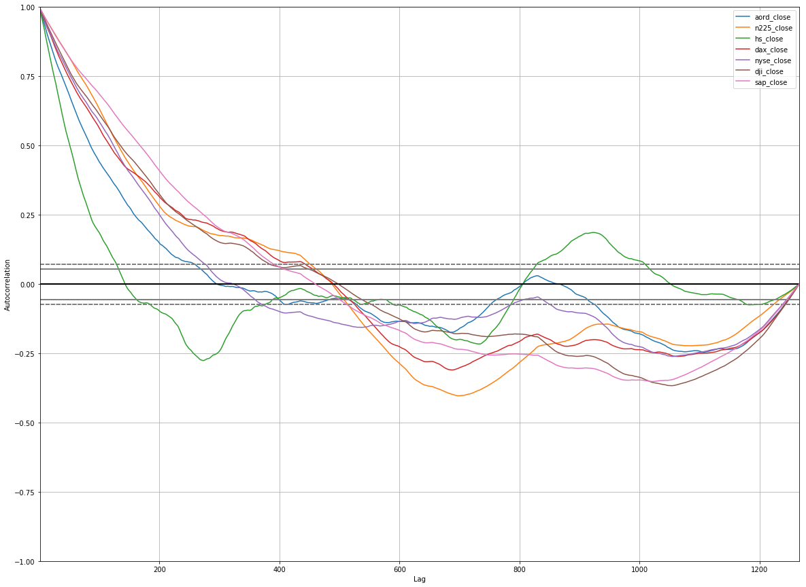
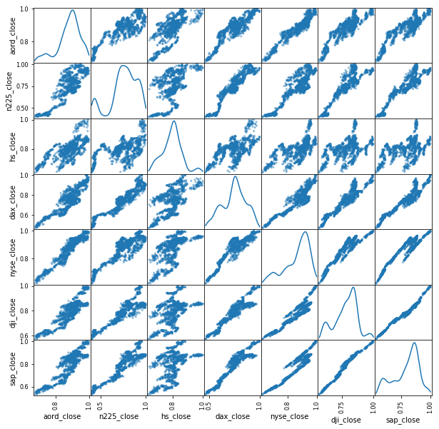
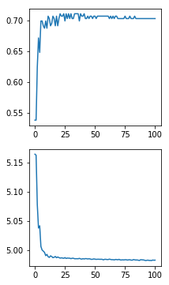

## Goal

With this project I will try to train a neural network to predict whether the stock market closing index S&P 500 will rise or fall on a particular date, based on most recent previous values and other stock markets around the world (where some markets close earlier that day because of time difference).

- All Ords (Australlia), closing EST= 01am
- Nikkei 225 (Japan), closing EST= 02am
- Hang Seng (Hong Kong), closing EST= 04am
- DAX (Germany), closing EST= 11:30am
- NYSE Composite (US), closing EST= 04pm
- Dow Jones Industrial Average (US), closing EST= 04pm
- S&P 500 (US), closing EST= 04pm

We can use closing price of All Ords, Nikkei 225, Hang Seng and DAX to predict closing price of S&P 500 on the same day, since they close earlier.


```python
import numpy as np
import pandas as pd
import tensorflow as tf
import datetime
import quandl
import matplotlib.pyplot as plt
%matplotlib inline
import functools
import math
```


```python
quandl.ApiConfig.api_key = "7w6LeRcCC_kYpMy4tMpw"
```

# Step 1: Prepare data

## I. Download data


```python
data_aus_aord = quandl.get("YAHOO/INDEX_AORD", start_date="2012-05-12")
data_jap_n225 = quandl.get("YAHOO/INDEX_N225", start_date="2012-05-12")
data_hk_hs = quandl.get("YAHOO/INDEX_HSI", start_date="2012-05-12")
data_ger_dax = quandl.get("YAHOO/INDEX_GDAXI", start_date="2012-05-12")
data_us_nyse = quandl.get("YAHOO/INDEX_NYA", start_date="2012-05-12")
data_us_dji = quandl.get("YAHOO/INDEX_DJI", start_date="2012-05-12")
data_us_sap = quandl.get("YAHOO/INDEX_GSPC", start_date="2012-05-12")
```

## II. Cut only interesting featrues


```python
closing_data = pd.DataFrame()

closing_data['aord_close'] = data_aus_aord['Adjusted Close']
closing_data['n225_close'] = data_jap_n225['Adjusted Close']
closing_data['hs_close']   = data_hk_hs['Adjusted Close']
closing_data['dax_close']  = data_ger_dax['Adjusted Close']
closing_data['nyse_close'] = data_us_nyse['Adjusted Close']
closing_data['dji_close']  = data_us_dji['Adjusted Close']
closing_data['sap_close']  = data_us_sap['Adjusted Close']
```

## III. Clean data


```python
# a) Remove unsuitable data (Hang Seng Hong Kong slip down around 18th April 2017)
closing_data = closing_data.drop([pd.Timestamp('2017-04-18')])
```


```python
# b) Fill gaps in the data.
closing_data = closing_data.fillna(method='ffill')
```


```python
# observe data
closing_data.describe()
```


<div>
<style>
    .dataframe thead tr:only-child th {
        text-align: right;
    }

    .dataframe thead th {
        text-align: left;
    }

    .dataframe tbody tr th {
        vertical-align: top;
    }
</style>
<table border="1" class="dataframe">
  <thead>
    <tr style="text-align: right;">
      <th></th>
      <th>aord_close</th>
      <th>n225_close</th>
      <th>hs_close</th>
      <th>dax_close</th>
      <th>nyse_close</th>
      <th>dji_close</th>
      <th>sap_close</th>
    </tr>
  </thead>
  <tbody>
    <tr>
      <th>count</th>
      <td>1266.000000</td>
      <td>1266.000000</td>
      <td>1266.000000</td>
      <td>1266.000000</td>
      <td>1266.000000</td>
      <td>1266.000000</td>
      <td>1266.000000</td>
    </tr>
    <tr>
      <th>mean</th>
      <td>5239.153158</td>
      <td>15549.734778</td>
      <td>22640.464390</td>
      <td>9549.518321</td>
      <td>10074.937708</td>
      <td>16591.304224</td>
      <td>1891.657344</td>
    </tr>
    <tr>
      <th>std</th>
      <td>437.584216</td>
      <td>3372.843870</td>
      <td>1881.399318</td>
      <td>1532.463234</td>
      <td>1035.863487</td>
      <td>2058.842802</td>
      <td>281.706715</td>
    </tr>
    <tr>
      <th>min</th>
      <td>4033.399902</td>
      <td>8295.629883</td>
      <td>18185.589844</td>
      <td>5969.399902</td>
      <td>7285.529785</td>
      <td>12101.459961</td>
      <td>1278.040039</td>
    </tr>
    <tr>
      <th>25%</th>
      <td>5047.100098</td>
      <td>14133.147949</td>
      <td>21541.010254</td>
      <td>8363.387451</td>
      <td>9460.867432</td>
      <td>15300.794678</td>
      <td>1676.860016</td>
    </tr>
    <tr>
      <th>50%</th>
      <td>5319.250000</td>
      <td>15913.924804</td>
      <td>22774.639649</td>
      <td>9661.850098</td>
      <td>10384.404785</td>
      <td>16873.934571</td>
      <td>1967.734985</td>
    </tr>
    <tr>
      <th>75%</th>
      <td>5518.575074</td>
      <td>18165.001953</td>
      <td>23658.695312</td>
      <td>10664.387207</td>
      <td>10847.809814</td>
      <td>17908.176758</td>
      <td>2094.947449</td>
    </tr>
    <tr>
      <th>max</th>
      <td>5976.399902</td>
      <td>20868.029297</td>
      <td>28442.750000</td>
      <td>12770.410156</td>
      <td>11661.219727</td>
      <td>21115.550781</td>
      <td>2399.629883</td>
    </tr>
  </tbody>
</table>
</div>


```python
# observe data in graph
plt.figure(figsize=(20,10))
plt.plot(closing_data)
plt.show()

# => data needs to be modifiend to fit the same scale
```





```python
# c) Normalize data to fit the same scale
closing_data_norm = pd.DataFrame()

closing_data_norm['aord_close'] = closing_data['aord_close'] / max(closing_data['aord_close'])
closing_data_norm['n225_close'] = closing_data['n225_close'] / max(closing_data['n225_close'])
closing_data_norm['hs_close']   = closing_data['hs_close']   / max(closing_data['hs_close'])
closing_data_norm['dax_close']  = closing_data['dax_close']  / max(closing_data['dax_close'])
closing_data_norm['nyse_close'] = closing_data['nyse_close'] / max(closing_data['nyse_close'])
closing_data_norm['dji_close']  = closing_data['dji_close']  / max(closing_data['dji_close'])
closing_data_norm['sap_close']  = closing_data['sap_close']  / max(closing_data['sap_close'])
```


```python
# observe trend in data in graph
plt.figure(figsize=(20,10))
plt.plot(closing_data_norm)
plt.show()
```





```python
# observe corelations in data in graph
fig = plt.figure()
fig.set_figwidth(20)
fig.set_figheight(15)

_ = pd.plotting.autocorrelation_plot(closing_data_norm['aord_close'], label='aord_close')
_ = pd.plotting.autocorrelation_plot(closing_data_norm['n225_close'], label='n225_close')
_ = pd.plotting.autocorrelation_plot(closing_data_norm['hs_close'], label='hs_close')
_ = pd.plotting.autocorrelation_plot(closing_data_norm['dax_close'], label='dax_close')
_ = pd.plotting.autocorrelation_plot(closing_data_norm['nyse_close'], label='nyse_close')
_ = pd.plotting.autocorrelation_plot(closing_data_norm['dji_close'], label='dji_close')
_ = pd.plotting.autocorrelation_plot(closing_data_norm['sap_close'], label='sap_close')

_ = plt.legend(loc='best')

# => strong corelations in smaller lag (up to ~400 lag), this meand resent past data corelates with upcomming data
```





```python
# observe corelations in data in matrix graph
_ = pd.plotting.scatter_matrix(closing_data_norm, figsize=(10, 10), diagonal='kde')

# => we can see there is significant corellation between market indexes on the same day
```





```python
# make time series data stationary in the mean, thus having no trend in the data
# aplying log(Vt/Vt-1) on all data
closing_data_norm_log = pd.DataFrame()

closing_data_norm_log['aord_close'] = np.log(closing_data['aord_close'] / closing_data['aord_close'].shift())
closing_data_norm_log['n225_close'] = np.log(closing_data['n225_close'] / closing_data['n225_close'].shift())
closing_data_norm_log['hs_close'] = np.log(closing_data['hs_close'] / closing_data['hs_close'].shift())
closing_data_norm_log['dax_close'] = np.log(closing_data['dax_close'] / closing_data['dax_close'].shift())
closing_data_norm_log['nyse_close'] = np.log(closing_data['nyse_close'] / closing_data['nyse_close'].shift())
closing_data_norm_log['dji_close'] = np.log(closing_data['dji_close'] / closing_data['dji_close'].shift())
closing_data_norm_log['sap_close'] = np.log(closing_data['sap_close'] / closing_data['sap_close'].shift())

# remove first row (contains NaN because of the t-1 shift)
closing_data_norm_log = closing_data_norm_log.iloc[1:]
closing_data_norm_log.describe()
```


<div>
<style>
    .dataframe thead tr:only-child th {
        text-align: right;
    }

    .dataframe thead th {
        text-align: left;
    }

    .dataframe tbody tr th {
        vertical-align: top;
    }
</style>
<table border="1" class="dataframe">
  <thead>
    <tr style="text-align: right;">
      <th></th>
      <th>aord_close</th>
      <th>n225_close</th>
      <th>hs_close</th>
      <th>dax_close</th>
      <th>nyse_close</th>
      <th>dji_close</th>
      <th>sap_close</th>
    </tr>
  </thead>
  <tbody>
    <tr>
      <th>count</th>
      <td>1265.000000</td>
      <td>1265.000000</td>
      <td>1265.000000</td>
      <td>1265.000000</td>
      <td>1265.000000</td>
      <td>1265.000000</td>
      <td>1265.000000</td>
    </tr>
    <tr>
      <th>mean</th>
      <td>0.000237</td>
      <td>0.000629</td>
      <td>0.000192</td>
      <td>0.000540</td>
      <td>0.000320</td>
      <td>0.000394</td>
      <td>0.000459</td>
    </tr>
    <tr>
      <th>std</th>
      <td>0.008099</td>
      <td>0.014623</td>
      <td>0.010528</td>
      <td>0.011733</td>
      <td>0.008036</td>
      <td>0.007572</td>
      <td>0.007879</td>
    </tr>
    <tr>
      <th>min</th>
      <td>-0.041143</td>
      <td>-0.096935</td>
      <td>-0.060183</td>
      <td>-0.070673</td>
      <td>-0.043961</td>
      <td>-0.036402</td>
      <td>-0.040211</td>
    </tr>
    <tr>
      <th>25%</th>
      <td>-0.004385</td>
      <td>-0.005947</td>
      <td>-0.004988</td>
      <td>-0.005126</td>
      <td>-0.003536</td>
      <td>-0.002942</td>
      <td>-0.003106</td>
    </tr>
    <tr>
      <th>50%</th>
      <td>0.000665</td>
      <td>0.000191</td>
      <td>0.000000</td>
      <td>0.000936</td>
      <td>0.000278</td>
      <td>0.000254</td>
      <td>0.000227</td>
    </tr>
    <tr>
      <th>75%</th>
      <td>0.005114</td>
      <td>0.008185</td>
      <td>0.005702</td>
      <td>0.006626</td>
      <td>0.004753</td>
      <td>0.004515</td>
      <td>0.004720</td>
    </tr>
    <tr>
      <th>max</th>
      <td>0.032049</td>
      <td>0.106654</td>
      <td>0.040211</td>
      <td>0.048521</td>
      <td>0.029209</td>
      <td>0.038755</td>
      <td>0.038291</td>
    </tr>
  </tbody>
</table>
</div>


# Step 2: Create training/testing dataset

## I. create labels (one-hot encoded)


```python
closing_data_norm_log['sap_rising'] = 0
closing_data_norm_log['sap_falling'] = 0

closing_data_norm_log.loc[closing_data_norm_log['sap_close'] >= 0, 'sap_rising'] = 1
closing_data_norm_log.loc[closing_data_norm_log['sap_close'] < 0, 'sap_falling'] = 1

closing_data_norm_log.describe()
```


<div>
<style>
    .dataframe thead tr:only-child th {
        text-align: right;
    }

    .dataframe thead th {
        text-align: left;
    }

    .dataframe tbody tr th {
        vertical-align: top;
    }
</style>
<table border="1" class="dataframe">
  <thead>
    <tr style="text-align: right;">
      <th></th>
      <th>aord_close</th>
      <th>n225_close</th>
      <th>hs_close</th>
      <th>dax_close</th>
      <th>nyse_close</th>
      <th>dji_close</th>
      <th>sap_close</th>
      <th>sap_rising</th>
      <th>sap_falling</th>
    </tr>
  </thead>
  <tbody>
    <tr>
      <th>count</th>
      <td>1265.000000</td>
      <td>1265.000000</td>
      <td>1265.000000</td>
      <td>1265.000000</td>
      <td>1265.000000</td>
      <td>1265.000000</td>
      <td>1265.000000</td>
      <td>1265.000000</td>
      <td>1265.000000</td>
    </tr>
    <tr>
      <th>mean</th>
      <td>0.000237</td>
      <td>0.000629</td>
      <td>0.000192</td>
      <td>0.000540</td>
      <td>0.000320</td>
      <td>0.000394</td>
      <td>0.000459</td>
      <td>0.550198</td>
      <td>0.449802</td>
    </tr>
    <tr>
      <th>std</th>
      <td>0.008099</td>
      <td>0.014623</td>
      <td>0.010528</td>
      <td>0.011733</td>
      <td>0.008036</td>
      <td>0.007572</td>
      <td>0.007879</td>
      <td>0.497671</td>
      <td>0.497671</td>
    </tr>
    <tr>
      <th>min</th>
      <td>-0.041143</td>
      <td>-0.096935</td>
      <td>-0.060183</td>
      <td>-0.070673</td>
      <td>-0.043961</td>
      <td>-0.036402</td>
      <td>-0.040211</td>
      <td>0.000000</td>
      <td>0.000000</td>
    </tr>
    <tr>
      <th>25%</th>
      <td>-0.004385</td>
      <td>-0.005947</td>
      <td>-0.004988</td>
      <td>-0.005126</td>
      <td>-0.003536</td>
      <td>-0.002942</td>
      <td>-0.003106</td>
      <td>0.000000</td>
      <td>0.000000</td>
    </tr>
    <tr>
      <th>50%</th>
      <td>0.000665</td>
      <td>0.000191</td>
      <td>0.000000</td>
      <td>0.000936</td>
      <td>0.000278</td>
      <td>0.000254</td>
      <td>0.000227</td>
      <td>1.000000</td>
      <td>0.000000</td>
    </tr>
    <tr>
      <th>75%</th>
      <td>0.005114</td>
      <td>0.008185</td>
      <td>0.005702</td>
      <td>0.006626</td>
      <td>0.004753</td>
      <td>0.004515</td>
      <td>0.004720</td>
      <td>1.000000</td>
      <td>1.000000</td>
    </tr>
    <tr>
      <th>max</th>
      <td>0.032049</td>
      <td>0.106654</td>
      <td>0.040211</td>
      <td>0.048521</td>
      <td>0.029209</td>
      <td>0.038755</td>
      <td>0.038291</td>
      <td>1.000000</td>
      <td>1.000000</td>
    </tr>
  </tbody>
</table>
</div>


## II. pick features and design dataframe


There will be 2 types of features to predict the market S&P 500 on timestamp T:
- features from markets that close before the market we are predicting (that means All Ords,Nikkei 225,Hang Seng and DAX), for this case we can use the closing value on day T since the market closed earlier, and T-1, T-2 (closing value from previous days)
- features from markets that close at the same time or after the predicted (for S&P 500 that will be the rest of the US market: Dow Jones Industrial Average, NYSE Composite), for this case we use T-1,T-2,T-3 values (values from 3 preceding dates)


```python
# including labels one-hot encoded (sap_rising, sap_falling)
feature_columns = ['sap_rising', 'sap_falling',
                  'aord_close_t0', 'aord_close_t1', 'aord_close_t2',
                  'n225_close_t0', 'n225_close_t1', 'n225_close_t2',
                  'hs_close_t0', 'hs_close_t1', 'hs_close_t2',
                  'dax_close_t0', 'dax_close_t1', 'dax_close_t2',
                  'nyse_close_t1', 'nyse_close_t2', 'nyse_close_t3',
                  'dji_close_t1', 'dji_close_t2', 'dji_close_t3',
                  'sap_close_t1', 'sap_close_t2', 'sap_close_t3']
dataset = pd.DataFrame(columns=feature_columns)
```


```python
# compose dataset from features
for i in range(3, len(closing_data_norm_log)):
    dataset = dataset.append({
        'sap_rising':    closing_data_norm_log.iloc[i]['sap_rising'],
        'sap_falling':   closing_data_norm_log.iloc[i]['sap_falling'],
        'aord_close_t0': closing_data_norm_log.iloc[i]['aord_close'],
        'aord_close_t1': closing_data_norm_log.iloc[i-1]['aord_close'],
        'aord_close_t2': closing_data_norm_log.iloc[i-2]['aord_close'],
        'n225_close_t0': closing_data_norm_log.iloc[i]['n225_close'],
        'n225_close_t1': closing_data_norm_log.iloc[i-1]['n225_close'],
        'n225_close_t2': closing_data_norm_log.iloc[i-2]['n225_close'],
        'hs_close_t0':   closing_data_norm_log.iloc[i]['hs_close'],
        'hs_close_t1':   closing_data_norm_log.iloc[i-1]['hs_close'],
        'hs_close_t2':   closing_data_norm_log.iloc[i-2]['hs_close'],
        'dax_close_t0':  closing_data_norm_log.iloc[i]['dax_close'],
        'dax_close_t1':  closing_data_norm_log.iloc[i-1]['dax_close'],
        'dax_close_t2':  closing_data_norm_log.iloc[i-2]['dax_close'],
        'nyse_close_t1': closing_data_norm_log.iloc[i-1]['nyse_close'],
        'nyse_close_t2': closing_data_norm_log.iloc[i-2]['nyse_close'],
        'nyse_close_t3': closing_data_norm_log.iloc[i-3]['nyse_close'],
        'dji_close_t1':  closing_data_norm_log.iloc[i-1]['dji_close'],
        'dji_close_t2':  closing_data_norm_log.iloc[i-2]['dji_close'],
        'dji_close_t3':  closing_data_norm_log.iloc[i-3]['dji_close'],
        'sap_close_t1':  closing_data_norm_log.iloc[i-1]['sap_close'],
        'sap_close_t2':  closing_data_norm_log.iloc[i-2]['sap_close'],
        'sap_close_t3':  closing_data_norm_log.iloc[i-3]['sap_close']},
        ignore_index=True
    )
```


```python
dataset.describe()
```


<div>
<style>
    .dataframe thead tr:only-child th {
        text-align: right;
    }

    .dataframe thead th {
        text-align: left;
    }

    .dataframe tbody tr th {
        vertical-align: top;
    }
</style>
<table border="1" class="dataframe">
  <thead>
    <tr style="text-align: right;">
      <th></th>
      <th>sap_rising</th>
      <th>sap_falling</th>
      <th>aord_close_t0</th>
      <th>aord_close_t1</th>
      <th>aord_close_t2</th>
      <th>n225_close_t0</th>
      <th>n225_close_t1</th>
      <th>n225_close_t2</th>
      <th>hs_close_t0</th>
      <th>hs_close_t1</th>
      <th>...</th>
      <th>dax_close_t2</th>
      <th>nyse_close_t1</th>
      <th>nyse_close_t2</th>
      <th>nyse_close_t3</th>
      <th>dji_close_t1</th>
      <th>dji_close_t2</th>
      <th>dji_close_t3</th>
      <th>sap_close_t1</th>
      <th>sap_close_t2</th>
      <th>sap_close_t3</th>
    </tr>
  </thead>
  <tbody>
    <tr>
      <th>count</th>
      <td>1262.000000</td>
      <td>1262.000000</td>
      <td>1262.000000</td>
      <td>1262.000000</td>
      <td>1262.000000</td>
      <td>1262.000000</td>
      <td>1262.000000</td>
      <td>1262.000000</td>
      <td>1262.000000</td>
      <td>1262.000000</td>
      <td>...</td>
      <td>1262.000000</td>
      <td>1262.000000</td>
      <td>1262.000000</td>
      <td>1262.000000</td>
      <td>1262.000000</td>
      <td>1262.000000</td>
      <td>1262.000000</td>
      <td>1262.000000</td>
      <td>1262.000000</td>
      <td>1262.000000</td>
    </tr>
    <tr>
      <th>mean</th>
      <td>0.551506</td>
      <td>0.448494</td>
      <td>0.000264</td>
      <td>0.000268</td>
      <td>0.000249</td>
      <td>0.000639</td>
      <td>0.000649</td>
      <td>0.000638</td>
      <td>0.000214</td>
      <td>0.000211</td>
      <td>...</td>
      <td>0.000546</td>
      <td>0.000333</td>
      <td>0.000331</td>
      <td>0.000322</td>
      <td>0.000402</td>
      <td>0.000401</td>
      <td>0.000398</td>
      <td>0.000469</td>
      <td>0.000467</td>
      <td>0.000462</td>
    </tr>
    <tr>
      <th>std</th>
      <td>0.497537</td>
      <td>0.497537</td>
      <td>0.008077</td>
      <td>0.008074</td>
      <td>0.008103</td>
      <td>0.014633</td>
      <td>0.014634</td>
      <td>0.014638</td>
      <td>0.010497</td>
      <td>0.010498</td>
      <td>...</td>
      <td>0.011743</td>
      <td>0.008040</td>
      <td>0.008041</td>
      <td>0.008045</td>
      <td>0.007579</td>
      <td>0.007579</td>
      <td>0.007580</td>
      <td>0.007885</td>
      <td>0.007886</td>
      <td>0.007888</td>
    </tr>
    <tr>
      <th>min</th>
      <td>0.000000</td>
      <td>0.000000</td>
      <td>-0.041143</td>
      <td>-0.041143</td>
      <td>-0.041143</td>
      <td>-0.096935</td>
      <td>-0.096935</td>
      <td>-0.096935</td>
      <td>-0.060183</td>
      <td>-0.060183</td>
      <td>...</td>
      <td>-0.070673</td>
      <td>-0.043961</td>
      <td>-0.043961</td>
      <td>-0.043961</td>
      <td>-0.036402</td>
      <td>-0.036402</td>
      <td>-0.036402</td>
      <td>-0.040211</td>
      <td>-0.040211</td>
      <td>-0.040211</td>
    </tr>
    <tr>
      <th>25%</th>
      <td>0.000000</td>
      <td>0.000000</td>
      <td>-0.004371</td>
      <td>-0.004349</td>
      <td>-0.004371</td>
      <td>-0.005928</td>
      <td>-0.005928</td>
      <td>-0.005943</td>
      <td>-0.004981</td>
      <td>-0.004981</td>
      <td>...</td>
      <td>-0.005117</td>
      <td>-0.003491</td>
      <td>-0.003530</td>
      <td>-0.003540</td>
      <td>-0.002941</td>
      <td>-0.002941</td>
      <td>-0.002951</td>
      <td>-0.003101</td>
      <td>-0.003105</td>
      <td>-0.003111</td>
    </tr>
    <tr>
      <th>50%</th>
      <td>1.000000</td>
      <td>0.000000</td>
      <td>0.000667</td>
      <td>0.000667</td>
      <td>0.000667</td>
      <td>0.000196</td>
      <td>0.000223</td>
      <td>0.000196</td>
      <td>0.000000</td>
      <td>0.000000</td>
      <td>...</td>
      <td>0.000945</td>
      <td>0.000283</td>
      <td>0.000283</td>
      <td>0.000278</td>
      <td>0.000265</td>
      <td>0.000265</td>
      <td>0.000265</td>
      <td>0.000255</td>
      <td>0.000255</td>
      <td>0.000234</td>
    </tr>
    <tr>
      <th>75%</th>
      <td>1.000000</td>
      <td>1.000000</td>
      <td>0.005139</td>
      <td>0.005139</td>
      <td>0.005139</td>
      <td>0.008180</td>
      <td>0.008186</td>
      <td>0.008186</td>
      <td>0.005694</td>
      <td>0.005694</td>
      <td>...</td>
      <td>0.006677</td>
      <td>0.004843</td>
      <td>0.004843</td>
      <td>0.004843</td>
      <td>0.004518</td>
      <td>0.004518</td>
      <td>0.004518</td>
      <td>0.004723</td>
      <td>0.004723</td>
      <td>0.004723</td>
    </tr>
    <tr>
      <th>max</th>
      <td>1.000000</td>
      <td>1.000000</td>
      <td>0.032049</td>
      <td>0.032049</td>
      <td>0.032049</td>
      <td>0.106654</td>
      <td>0.106654</td>
      <td>0.106654</td>
      <td>0.040211</td>
      <td>0.040211</td>
      <td>...</td>
      <td>0.048521</td>
      <td>0.029209</td>
      <td>0.029209</td>
      <td>0.029209</td>
      <td>0.038755</td>
      <td>0.038755</td>
      <td>0.038755</td>
      <td>0.038291</td>
      <td>0.038291</td>
      <td>0.038291</td>
    </tr>
  </tbody>
</table>
<p>8 rows × 23 columns</p>
</div>


```python
class DataProvider():
    def __init__(self, dataset, batch_size):
        self.ctr = 0
        self.batch_size = batch_size
        
        # split training/testing according to ratio (default 0.8)
        train_set_size = int(len(dataset) * 0.8)
        test_set_size = len(dataset) - train_set_size

        self.training_dataset = dataset[:train_set_size]
        self.testing_dataset  = dataset[train_set_size:]

        # split labels
        self.training_labels = self.training_dataset[self.training_dataset.columns[:2]]
        self.training_dataset = self.training_dataset[self.training_dataset.columns[2:]]
        self.testing_labels = self.testing_dataset[self.testing_dataset.columns[:2]]
        self.testing_dataset = self.testing_dataset[self.testing_dataset.columns[2:]]
        
    def next_batch_train(self):
        begin_position = self.ctr * self.batch_size
        
        if begin_position + self.batch_size >= len(self.training_dataset):
            data = self.training_dataset[begin_position:]
            label = self.training_labels[begin_position:]
            self.ctr = 0
        else:
            data = self.training_dataset[begin_position:begin_position + self.batch_size]
            label = self.training_labels[begin_position:begin_position + self.batch_size]
            self.ctr += 1
        
        return data.values, label.values
    
    def get_test_data(self):
        return self.testing_dataset.values, self.testing_labels.values
```

# Step 3: Create Model


```python
# config
no_of_iterations = 50000
batch_size = 200

## model config
hidden_layer1_neurons = 60
hidden_layer2_neurons = 30
hidden_layer3_neurons = 20

# DropOut
pkeep_train = 0.75

# number of features
input_dim = len(dataset.columns) - 2

# number of output classes
output_dim = 2
```


```python
data_provider = DataProvider(dataset, batch_size)
```


```python
# custom decorator for Model
#  - to make functions execute only the first time (every time the functions are called, the graph would be extended by new code)
#  - name the variable scope for TF visualization
def define_scope(function, scope=None):
    attribute = '_cache_' + function.__name__

    name = scope or function.__name__
    @property
    @functools.wraps(function)
    def decorator(self):
        if not hasattr(self, attribute):
            with tf.variable_scope(name):
                setattr(self, attribute, function(self))
        return getattr(self, attribute)

    return decorator
```

Model description:
Model consists of 3 hidden layers + 1 softmax output layer.
Incorporates shootout while training to make inidividual neurons more independent on other layers and perform better.
Incorporates learning rate decay.


```python
class Model():
    def __init__(self, data, label, learning_rate):
        self.data = data
        self.label = label
        self.learning_rate = learning_rate
        self.prediction
        self.optimize
        
    @define_scope
    def prediction(self):        
        # weights + biases
        w1 = tf.Variable(tf.truncated_normal([input_dim, hidden_layer1_neurons], stddev=0.0001))
        b1 = tf.Variable(tf.ones([hidden_layer1_neurons]))

        w2 = tf.Variable(tf.truncated_normal([hidden_layer1_neurons, hidden_layer2_neurons], stddev=0.0001))
        b2 = tf.Variable(tf.ones([hidden_layer2_neurons]))

        w3 = tf.Variable(tf.truncated_normal([hidden_layer2_neurons, hidden_layer3_neurons], stddev=0.0001))
        b3 = tf.Variable(tf.ones([hidden_layer3_neurons]))
        
        w4 = tf.Variable(tf.truncated_normal([hidden_layer3_neurons, output_dim], stddev=0.0001))
        b4 = tf.Variable(tf.ones([output_dim]))
        
        # hidden layers
        Y1 = tf.nn.relu(tf.matmul(self.data, w1) + b1)
        Y1d = tf.nn.dropout(Y1, pkeep)
        Y2 = tf.nn.relu(tf.matmul(Y1, w2) + b2)
        Y2d = tf.nn.dropout(Y2, pkeep)
        Y3 = tf.nn.relu(tf.matmul(Y2, w3) + b3)
        Y3d = tf.nn.dropout(Y3, pkeep)
        
        # softmax layer
        return tf.nn.softmax(tf.matmul(Y3d, w4) + b4)
    
    @define_scope
    def optimize(self):
        # compute cost function and minimize
        cross_entropy = -tf.reduce_sum(self.label * tf.log(self.prediction))
        return tf.train.AdamOptimizer(learning_rate=learning_rate).minimize(cross_entropy), cross_entropy
    
    @define_scope
    def error(self):
        mistakes = tf.equal(tf.argmax(self.label, 1), tf.argmax(self.prediction, 1))
        accuracy = tf.reduce_mean(tf.cast(mistakes, tf.float32))
        loss = -tf.reduce_sum(self.label * tf.log(self.prediction))
        return accuracy, loss
```


```python
# data feed
X = tf.placeholder(tf.float32, [None, input_dim])
_Y = tf.placeholder(tf.float32, [None, output_dim])
learning_rate = tf.placeholder(tf.float32)

# DropOut: feed in 1 when testing, 0.75 when training
pkeep = tf.placeholder(tf.float32)
```


```python
model = Model(data=X, label=_Y, learning_rate=learning_rate)
```


```python
sess = tf.Session()
init = tf.global_variables_initializer()
sess.run(init)

accuracy = []
_loss = []
for i in range(no_of_iterations):
    # execute training step
    # optimizer learning rate decay
    lrmax = 0.001
    lrmin = 0.00001
    lr = lrmin + (lrmax - lrmin) * math.exp(-i / 2000)
    
    data_batch, label_batch = data_provider.next_batch_train()
    sess.run(model.optimize, feed_dict={X: data_batch, _Y: label_batch, learning_rate:lr, pkeep: pkeep_train})
    
    if i % 500 == 0:
        # compute accuracy
        data_batch, label_batch = data_provider.get_test_data()
        acc, loss = sess.run(model.error, feed_dict={X: data_batch, _Y: label_batch, pkeep: 1})
        accuracy.append(acc)
        _loss.append(loss)
        print('---epoch {}---\naccuracy: {}, loss: {}'.format(i // 500, acc, loss))
        

# accuracy on test data
data_batch, label_batch = data_provider.get_test_data()
acc, loss = sess.run(model.error, feed_dict={X: data_batch, _Y: label_batch, pkeep: 1})
accuracy.append(acc)
_loss.append(loss)
print('Training finished\naccuracy: {}, loss: {}'.format(acc, loss))
```

    ---epoch 0---
    accuracy: 0.5375494360923767, loss: 175.0313262939453
    ---epoch 1---
    accuracy: 0.5375494360923767, loss: 174.73214721679688
    ---epoch 2---
    accuracy: 0.6245059370994568, loss: 160.46951293945312
    ---epoch 3---
    accuracy: 0.6719367504119873, loss: 154.16432189941406
    ---epoch 4---
    accuracy: 0.6482213735580444, loss: 154.75250244140625
    ---epoch 5---
    accuracy: 0.6996047496795654, loss: 149.36366271972656
    ---epoch 6---
    accuracy: 0.6996047496795654, loss: 148.45147705078125
    ---epoch 7---
    accuracy: 0.6916996240615845, loss: 148.16934204101562
    ---epoch 8---
    accuracy: 0.687747061252594, loss: 147.85240173339844
    ---epoch 9---
    accuracy: 0.6996047496795654, loss: 147.0128631591797
    ---epoch 10---
    accuracy: 0.687747061252594, loss: 147.3420867919922
    ---epoch 11---
    accuracy: 0.7075098752975464, loss: 146.75540161132812
    ---epoch 12---
    accuracy: 0.7035573124885559, loss: 146.57211303710938
    ---epoch 13---
    accuracy: 0.6916996240615845, loss: 146.97091674804688
    ---epoch 14---
    accuracy: 0.695652186870575, loss: 146.7982177734375
    ---epoch 15---
    accuracy: 0.7075098752975464, loss: 146.50933837890625
    ---epoch 16---
    accuracy: 0.7035573124885559, loss: 146.6106719970703
    ---epoch 17---
    accuracy: 0.6916996240615845, loss: 146.8138427734375
    ---epoch 18---
    accuracy: 0.7075098752975464, loss: 146.4955291748047
    ---epoch 19---
    accuracy: 0.6916996240615845, loss: 146.6897430419922
    ---epoch 20---
    accuracy: 0.7035573124885559, loss: 146.53323364257812
    ---epoch 21---
    accuracy: 0.7114624381065369, loss: 146.39727783203125
    ---epoch 22---
    accuracy: 0.7075098752975464, loss: 146.46803283691406
    ---epoch 23---
    accuracy: 0.7075098752975464, loss: 146.42022705078125
    ---epoch 24---
    accuracy: 0.7114624381065369, loss: 146.34461975097656
    ---epoch 25---
    accuracy: 0.6996047496795654, loss: 146.52679443359375
    ---epoch 26---
    accuracy: 0.7114624381065369, loss: 146.31039428710938
    ---epoch 27---
    accuracy: 0.7035573124885559, loss: 146.41171264648438
    ---epoch 28---
    accuracy: 0.7114624381065369, loss: 146.3848114013672
    ---epoch 29---
    accuracy: 0.7035573124885559, loss: 146.37594604492188
    ---epoch 30---
    accuracy: 0.7114624381065369, loss: 146.262451171875
    ---epoch 31---
    accuracy: 0.7035573124885559, loss: 146.36085510253906
    ---epoch 32---
    accuracy: 0.7035573124885559, loss: 146.36378479003906
    ---epoch 33---
    accuracy: 0.7114624381065369, loss: 146.2462158203125
    ---epoch 34---
    accuracy: 0.7114624381065369, loss: 146.2450714111328
    ---epoch 35---
    accuracy: 0.7114624381065369, loss: 146.25576782226562
    ---epoch 36---
    accuracy: 0.7114624381065369, loss: 146.234619140625
    ---epoch 37---
    accuracy: 0.6996047496795654, loss: 146.3397979736328
    ---epoch 38---
    accuracy: 0.7114624381065369, loss: 146.2144775390625
    ---epoch 39---
    accuracy: 0.7075098752975464, loss: 146.14390563964844
    ---epoch 40---
    accuracy: 0.7075098752975464, loss: 146.26747131347656
    ---epoch 41---
    accuracy: 0.7114624381065369, loss: 146.1763458251953
    ---epoch 42---
    accuracy: 0.7035573124885559, loss: 146.2766876220703
    ---epoch 43---
    accuracy: 0.7035573124885559, loss: 146.25521850585938
    ---epoch 44---
    accuracy: 0.7075098752975464, loss: 146.1848602294922
    ---epoch 45---
    accuracy: 0.7035573124885559, loss: 146.24456787109375
    ---epoch 46---
    accuracy: 0.7075098752975464, loss: 146.1893310546875
    ---epoch 47---
    accuracy: 0.7075098752975464, loss: 146.08203125
    ---epoch 48---
    accuracy: 0.7035573124885559, loss: 146.10629272460938
    ---epoch 49---
    accuracy: 0.7075098752975464, loss: 146.20016479492188
    ---epoch 50---
    accuracy: 0.7075098752975464, loss: 146.14413452148438
    ---epoch 51---
    accuracy: 0.7035573124885559, loss: 146.0821533203125
    ---epoch 52---
    accuracy: 0.7075098752975464, loss: 146.11019897460938
    ---epoch 53---
    accuracy: 0.7075098752975464, loss: 146.11968994140625
    ---epoch 54---
    accuracy: 0.7075098752975464, loss: 146.093017578125
    ---epoch 55---
    accuracy: 0.7075098752975464, loss: 146.10888671875
    ---epoch 56---
    accuracy: 0.7075098752975464, loss: 146.0944366455078
    ---epoch 57---
    accuracy: 0.7075098752975464, loss: 145.96226501464844
    ---epoch 58---
    accuracy: 0.7075098752975464, loss: 146.09552001953125
    ---epoch 59---
    accuracy: 0.7075098752975464, loss: 146.09706115722656
    ---epoch 60---
    accuracy: 0.7075098752975464, loss: 146.03797912597656
    ---epoch 61---
    accuracy: 0.7075098752975464, loss: 146.0452117919922
    ---epoch 62---
    accuracy: 0.7035573124885559, loss: 146.13832092285156
    ---epoch 63---
    accuracy: 0.7075098752975464, loss: 146.06585693359375
    ---epoch 64---
    accuracy: 0.7035573124885559, loss: 145.9984130859375
    ---epoch 65---
    accuracy: 0.7075098752975464, loss: 146.0222625732422
    ---epoch 66---
    accuracy: 0.7035573124885559, loss: 145.9451141357422
    ---epoch 67---
    accuracy: 0.7075098752975464, loss: 146.05604553222656
    ---epoch 68---
    accuracy: 0.7075098752975464, loss: 146.03668212890625
    ---epoch 69---
    accuracy: 0.7035573124885559, loss: 145.9808807373047
    ---epoch 70---
    accuracy: 0.7035573124885559, loss: 146.09136962890625
    ---epoch 71---
    accuracy: 0.7035573124885559, loss: 145.9466094970703
    ---epoch 72---
    accuracy: 0.7035573124885559, loss: 145.929443359375
    ---epoch 73---
    accuracy: 0.7035573124885559, loss: 145.974365234375
    ---epoch 74---
    accuracy: 0.7035573124885559, loss: 145.93800354003906
    ---epoch 75---
    accuracy: 0.7075098752975464, loss: 145.9921417236328
    ---epoch 76---
    accuracy: 0.7035573124885559, loss: 145.98899841308594
    ---epoch 77---
    accuracy: 0.7035573124885559, loss: 145.90771484375
    ---epoch 78---
    accuracy: 0.7035573124885559, loss: 145.97149658203125
    ---epoch 79---
    accuracy: 0.7075098752975464, loss: 145.98829650878906
    ---epoch 80---
    accuracy: 0.7035573124885559, loss: 145.8973388671875
    ---epoch 81---
    accuracy: 0.7035573124885559, loss: 145.876708984375
    ---epoch 82---
    accuracy: 0.7035573124885559, loss: 146.02978515625
    ---epoch 83---
    accuracy: 0.7075098752975464, loss: 145.96969604492188
    ---epoch 84---
    accuracy: 0.7035573124885559, loss: 145.9158477783203
    ---epoch 85---
    accuracy: 0.7035573124885559, loss: 145.937255859375
    ---epoch 86---
    accuracy: 0.7035573124885559, loss: 145.87564086914062
    ---epoch 87---
    accuracy: 0.7035573124885559, loss: 145.8106231689453
    ---epoch 88---
    accuracy: 0.7035573124885559, loss: 145.99627685546875
    ---epoch 89---
    accuracy: 0.7035573124885559, loss: 145.96737670898438
    ---epoch 90---
    accuracy: 0.7035573124885559, loss: 145.9488525390625
    ---epoch 91---
    accuracy: 0.7035573124885559, loss: 145.894287109375
    ---epoch 92---
    accuracy: 0.7035573124885559, loss: 145.7903289794922
    ---epoch 93---
    accuracy: 0.7035573124885559, loss: 145.83009338378906
    ---epoch 94---
    accuracy: 0.7035573124885559, loss: 145.8909912109375
    ---epoch 95---
    accuracy: 0.7035573124885559, loss: 145.80999755859375
    ---epoch 96---
    accuracy: 0.7035573124885559, loss: 145.8195037841797
    ---epoch 97---
    accuracy: 0.7035573124885559, loss: 145.7799072265625
    ---epoch 98---
    accuracy: 0.7035573124885559, loss: 145.91021728515625
    ---epoch 99---
    accuracy: 0.7035573124885559, loss: 145.8651123046875
    Training finished
    accuracy: 0.7035573124885559, loss: 145.88699340820312


```python
plt.figure(figsize=(3,6))

# accuracy
plt.subplot(211)
plt.plot(accuracy)

# loss
plt.subplot(212)
plt.plot(np.log(_loss))

plt.show()
```





With current settings the deep neural network performs with accuracy close to 70%. This number could be potentially further increased by introducing more data (more features or larger training dataset) or by tweaking Model parameters.
